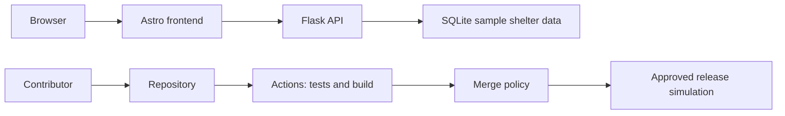

# Workshop notes

Goal: improve the shelter's delivery process.

change -> PR -> checks -> merge

The current tests do not test for failure when getting dogs

| Asset and risk | Control to complete | Owner to assign | Acceptance result |
|---|---|---|---|
| API process: direct startup enables a debugger | Safe default plus regression test | ___ | `debug=False` asserted and targeted CodeQL finding removed |
| Dependency change: introduces a vulnerable package | ___ | Maintainer | High-severity introduction fails review; repaired version passes |
| Repository history: contains a credential | Repository push protection and exposure response | ___ | Verified nonfunctional fixture blocked; clean retry succeeds |
